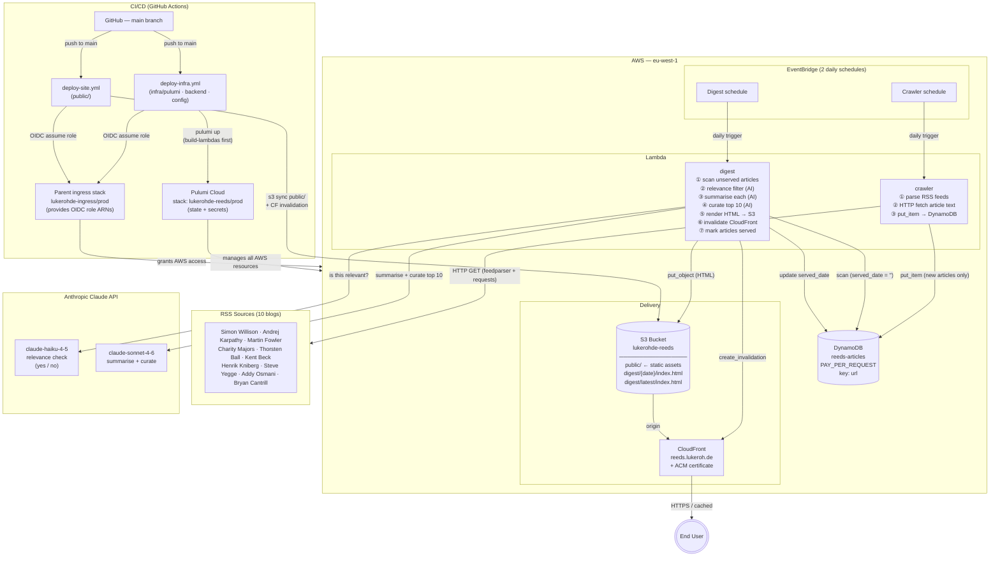

# Reeds — Deployed Architecture

## Data flow summary

| Stage | From | To | What |
|---|---|---|---|
| **Extract** | EventBridge | Crawler Lambda | daily cron |
| | RSS feeds | Crawler Lambda | feed entries + article HTML |
| | Crawler Lambda | DynamoDB | articles (url, title, content, author, dates) |
| **Transform** | EventBridge | Digest Lambda | daily cron |
| | DynamoDB | Digest Lambda | unserved articles |
| | Digest Lambda | Claude Haiku | relevance check per article |
| | Digest Lambda | Claude Sonnet | summary per relevant article |
| | Digest Lambda | Claude Sonnet | curate top 10 from pool |
| | Digest Lambda | DynamoDB | write `status`, `summary`, `served_date` |
| **Load** | Digest Lambda | S3 | `digest/{date}/index.html` + `latest/` |
| | Digest Lambda | CloudFront | cache invalidation |
| **Serve** | S3 | CloudFront | origin |
| | CloudFront | User | cached HTTPS at `reeds.lukeroh.de` |

## Cost profile

| Resource | Tier |
|---|---|
| Lambda (2 functions, ~60 invocations/month) | Free tier |
| DynamoDB (PAY_PER_REQUEST) | Free tier |
| EventBridge (2 schedules) | Free |
| S3 (~10 KB HTML) | ~$0.001/month |
| CloudFront | Free tier |
| ACM certificate | Free |

**Target: < $1/month** (AI API calls are the dominant cost)
